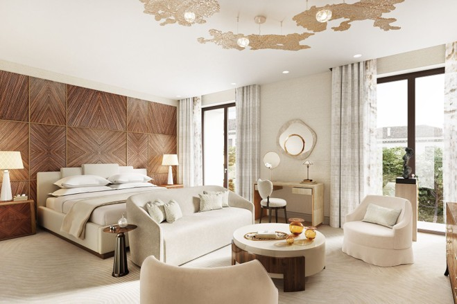

# All I Luxe — Premium Luxury Furniture E-Commerce Platform



**All I Luxe** is a sophisticated online marketplace dedicated exclusively to buying, showcasing, and purchasing high-end luxury furniture. Designed with an elegant aesthetic and modern architecture, the platform connects discerning buyers with timeless interior furnishings while offering sellers an effortless avenue to list designer pieces.

---

## 📑 Table of Contents

- [Project Overview](#project-overview)
- [Key Features](#key-features)
- [Technology Stack](#technology-stack)
- [Workspace Directory Structure](#workspace-directory-structure)
- [Getting Started & Installation](#getting-started--installation)
  - [Prerequisites](#prerequisites)
  - [Local Setup via XAMPP / WAMP](#local-setup-via-xampp--wamp)
  - [Frontend-Only Live Preview](#frontend-only-live-preview)
- [Database Configuration](#database-configuration)
- [User Roles & Flows](#user-roles--flows)
- [Directory Documentation Index](#directory-documentation-index)
- [Developer & Academic Context](#developer--academic-context)
- [License](#license)

---

## 🌟 Project Overview

The mission of **All I Luxe** is to curate and deliver a bespoke digital shopping experience reflective of world-class interior design showrooms. From handcrafted dining tables and executive bedroom suites to premium velvet lounges and artisan accents, the marketplace balances opulence with ease-of-use.

---

## ✨ Key Features

- **Luxury Catalogue Browsing**:
  - Filtered viewing by collections: [Bedroom](shopBedroom.html), [Dining](shopDining.html), and [Lounge](shopLounge.html).
  - High-resolution multi-angle product photography with interactive gallery thumbnails.
  - Category exploration via [Browse Furniture](browseFurniture.html).
- **Interactive Shopping Experience**:
  - Live client-side Wishlist counter and saved items ([wishlist.html](wishlist.html)).
  - Shopping Cart management with dynamic total calculations ([addtoCart.html](addtoCart.html)).
  - Secure multi-method checkout and payment gateway simulator ([payment.html](payment.html)).
  - Automated downloadable PDF invoice receipt generation on order confirmation ([thankyou.html](thankyou.html)).
- **Multi-Role Authentication**:
  - Customer login and registration ([assignmentRegistration.html](assignmentRegistration.html), [signupPage.html](signupPage.html)).
  - Dedicated seller registration portal with age validation ([sellToUsPage.html](sellToUsPage.html), [backend/products/sellersSignUpPage.php](backend/products/sellersSignUpPage.php)).
  - Protected admin portal with session management ([backend/admin/adminLogin.php](backend/admin/adminLogin.php), [backend/admin/admin.php](backend/admin/admin.php)).
- **Seller Management Dashboard**:
  - Real-time seller dashboard with listing status counters ([sellersdashboard.html](sellersdashboard.html)).
  - Multi-photo upload modal with client validation and previews ([backend/products/uploadFurniture.php](backend/products/uploadFurniture.php)).
- **White-Glove Customer Care**:
  - In-home interior design consultation bookings ([homeConsultation.html](homeConsultation.html)).
  - Physical showroom locator ([findLocation.html](findLocation.html)).
  - Furniture valuation inquiry forms ([evaluation.html](evaluation.html)).
  - Comprehensive customer support, FAQs, shipping, returns, and privacy policies.

---

## 🛠️ Technology Stack

| Layer | Technologies |
| :--- | :--- |
| **Front-End View** | HTML5 (Semantic), CSS3 (Modern Flexbox, CSS Grid, Custom Properties) |
| **Client Scripting** | Vanilla JavaScript (ES6+), Google Identity Services (GIS OAuth) |
| **Iconography & Fonts** | Font Awesome 6.5.0, Google Fonts (*Playfair Display*, *Lora*, *Montserrat*, *Cormorant Garamond*) |
| **Server-Side** | PHP 8.x (Session management, prepared statements, file uploads) |
| **Database** | MySQL / MariaDB (Relational tables: users, sellers, furniture, orders, images) |
| **Development** | Visual Studio Code, XAMPP / Apache, Git & GitHub |

---

## 📂 Workspace Directory Structure

The project follows a clean, modular architecture:

```
All-I-Luxe-E-Commerce-Platform/
├── .vscode/
│   └── launch.json                  # VS Code Edge/Chrome local debugger config
├── .gitignore                       # Git ignore rules for system caches & secrets
├── README.md                        # Master repository documentation
│
├── assets/                          # Static web assets
│   ├── README.md                    # Asset guidelines & architecture
│   ├── css/                         # All 27 stylesheets (modularized)
│   │   ├── README.md                # Style guide, design system & CSS registry
│   │   ├── homePage.css
│   │   ├── shopBedroom.css
│   │   ├── payment.css
│   │   └── ...
│   ├── js/                          # Client-side JavaScript modules
│   │   ├── README.md                # Client modules & localStorage state guide
│   │   ├── auth.js                  # Authentication & session state
│   │   ├── dashboard.js             # Seller dashboard & listing manager
│   │   ├── upload.js                # Photo upload preview & validation
│   │   ├── addToCart.js             # Cart items & badge state
│   │   ├── contactUs.js             # Contact form validation & handler
│   │   ├── aboutUs.js               # About us hero carousel & animations
│   │   └── registration.js          # Client-side signup/login validation
│   └── images/                      # Curated high-resolution media & icons
│       └── README.md                # Image asset catalog & optimization guide
│
├── backend/                         # Server-side PHP scripts & database logic
│   ├── README.md                    # Backend architecture & API documentation
│   ├── config/
│   │   ├── db.php                   # Centralized database connection
│   │   └── config.example.php       # Template database credentials
│   ├── auth/                        # User & seller authentication endpoints
│   │   ├── userLogin.php
│   │   ├── signupForm.php
│   │   ├── sellerLogin.php
│   │   └── sellerSignUp.php
│   ├── admin/                       # Administration management & authentication
│   │   ├── admin.php
│   │   └── adminLogin.php
│   └── products/                    # Furniture uploading & seller onboarding
│       ├── uploadFurniture.php
│       ├── uploadImages.php
│       └── sellersSignUpPage.php
│
├── coursework/                      # University practical exercises & labs
│   ├── README.md                    # Academic context & lab notes
│   ├── week6.php                    # Week 6 XAMPP database linking activity
│   └── week6Form.html               # Week 6 HTML input form
│
├── docs/                            # Deep-dive architecture and design specs
│   ├── ARCHITECTURE.md              # Detailed application architecture & sitemap
│   └── DATABASE.md                  # Relational schema & entity definitions
│
├── index.html                       # Homepage & primary landing page
├── aboutUsPage.html                 # Brand heritage & company story
├── browseFurniture.html             # Furniture category showcase
├── shopBedroom.html                 # Bedroom suites collection
├── shopDining.html                  # Dining room furniture collection
├── shopLounge.html                  # Lounge & living room furniture collection
├── viewProduct.html                 # Detailed product view (Vivian suite)
├── viewProductAuroraLounge.html     # Product view: Aurora Lounge Suite
├── viewProductMonarch.html          # Product view: Monarch Bedroom Suite
├── viewProductNestChair.html        # Product view: Nest Accent Chair
├── viewProductValentinaCorner.html  # Product view: Valentina Corner Suite
├── viewVelvetSofa.html              # Product view: Velvet Luxury Sofa
├── wishlist.html                    # Saved items wishlist view
├── addtoCart.html                   # Shopping cart summary view
├── payment.html                     # Checkout & card/EFT payment form
├── thankyou.html                    # Order confirmation & PDF invoice
├── sellersdashboard.html            # Seller inventory & listing dashboard
├── sellToUsPage.html                # Seller information & intake portal
├── assignmentRegistration.html      # User / seller login portal
├── signupPage.html                  # Customer registration portal
├── contactUs.html                   # Contact form & enquiry page
├── findLocation.html                # Store & showroom locations
├── homeConsultation.html            # In-home design consultation booking
├── consultationSuccess.html         # Consultation booking confirmation
├── evaluation.html                  # Furniture evaluation request form
├── faq.html                         # Frequently asked questions
├── shipping.html                    # Shipping and delivery terms
├── returns.html                     # Returns and refunds policy
└── privacy.html                     # Privacy policy & data protection
```

---

## 🚀 Getting Started & Installation

### Prerequisites
- A modern web browser (Google Chrome, Microsoft Edge, Mozilla Firefox, or Safari).
- For PHP and MySQL functionality: **XAMPP**, **WAMP**, or **MAMP** (PHP 8.0+ and MariaDB/MySQL).
- Code Editor: Visual Studio Code with the *Live Server* and *PHP Server* extensions (recommended).

### Local Setup via XAMPP / WAMP
1. Clone or download this repository into your web server's root directory:
   ```bash
   git clone https://github.com/Qhamani24/All-I-Luxe-E-Commerce-Platform.git
   ```
   *For XAMPP on Windows, place it into `C:\xampp\htdocs\All-I-Luxe-E-Commerce-Platform`.*
2. Start **Apache** and **MySQL** from the XAMPP Control Panel.
3. Open `http://localhost/phpmyadmin` in your browser.
4. Create a database named `if0_41972949_accounts` (or create a local database and configure `backend/config/db.php`).
5. Open `http://localhost/All-I-Luxe-E-Commerce-Platform/index.html` in your web browser.

### Frontend-Only Live Preview
If you only need to preview the client-side design:
1. Open the project root folder in **Visual Studio Code**.
2. Right-click on `index.html` and select **"Open with Live Server"**.
3. Browse all catalog pages, cart interactions, and views.

---

## 🗄️ Database Configuration

Database connection parameters are centralized in [`backend/config/db.php`](backend/config/db.php).

To customize your local database credentials:
1. Refer to the template in [`backend/config/config.example.php`](backend/config/config.example.php).
2. Set environment variables (`DB_HOST`, `DB_USER`, `DB_PASS`, `DB_NAME`), or edit `backend/config/db.php` directly:
   ```php
   $servername = "localhost";
   $username   = "root";
   $password   = "";
   $dbname     = "all_i_luxe_db";
   ```
3. Full schema details and table structures are documented in [`docs/DATABASE.md`](docs/DATABASE.md).

---

## 👥 User Roles & Flows

1. **Guest Shopper**:
   - Browse furniture by category, view suites, add items to wishlist or cart, and proceed through checkout.
2. **Registered Customer**:
   - Login via `assignmentRegistration.html`, track orders, and complete accelerated checkouts.
3. **Consignment Seller**:
   - Register via `backend/products/sellersSignUpPage.php` or `sellToUsPage.html`.
   - Access `sellersdashboard.html` to manage listings, view performance metrics, and submit new furniture with photos for appraisal.
4. **Platform Administrator**:
   - Secure login via `backend/admin/adminLogin.php`.
   - Manage pending furniture approvals, oversee orders, and view seller accounts in `backend/admin/admin.php`.

---

## 📖 Directory Documentation Index

Detailed documentation is available in every functional directory:
- [Static Assets Documentation](assets/README.md)
- [CSS Architecture & Style Guide](assets/css/README.md)
- [JavaScript Modules & State Guide](assets/js/README.md)
- [Image Asset Catalog](assets/images/README.md)
- [Backend PHP Architecture & Security](backend/README.md)
- [Academic Coursework Activities](coursework/README.md)
- [System Architecture & Sitemap Specification](docs/ARCHITECTURE.md)
- [Database Schema & Entity Documentation](docs/DATABASE.md)

---

## 🎓 Developer & Academic Context

- **Developer**: **Qhamani Mona**
- **Programme**: Bachelor of Science in Information Technology (Software Engineering)
- **Institution**: Eduvos East London Campus
- **Repository**: [GitHub Repository](https://github.com/Qhamani24/All-I-Luxe-E-Commerce-Platform)

---

## 📄 License

This project is created for educational and portfolio demonstration purposes as part of the BSc Information Technology curriculum at Eduvos. All brand concepts and imagery remain the property of their respective creators.
