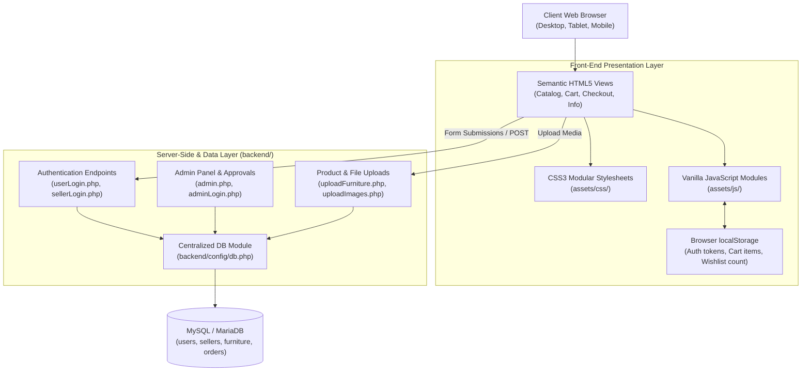
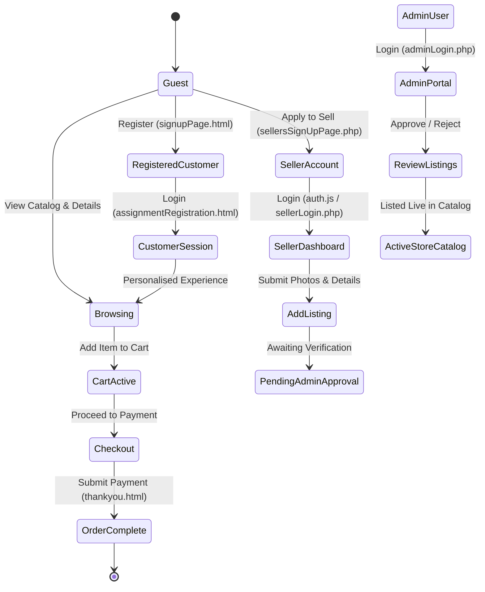

# All I Luxe — System Architecture & Site Map

This document provides a comprehensive technical overview of the system architecture, component relationships, user workflows, and navigation hierarchy of the **All I Luxe** platform.

---

## 🏛️ System Architecture



---

## 🗺️ Sitemap & Page Hierarchy

```
Homepage (index.html)
│
├── Catalog & Product Discovery
│   ├── Browse All Categories (browseFurniture.html)
│   ├── Shop Bedroom (shopBedroom.html)
│   │   ├── Product View: Vivian Suite (viewProduct.html)
│   │   └── Product View: Monarch Suite (viewProductMonarch.html)
│   ├── Shop Dining (shopDining.html)
│   └── Shop Lounge (shopLounge.html)
│       ├── Product View: Aurora Lounge (viewProductAuroraLounge.html)
│       ├── Product View: Nest Chair (viewProductNestChair.html)
│       ├── Product View: Valentina Corner (viewProductValentinaCorner.html)
│       └── Product View: Velvet Luxury Sofa (viewVelvetSofa.html)
│
├── Customer Transactions & Cart
│   ├── Saved Items (wishlist.html)
│   ├── Shopping Cart (addtoCart.html)
│   ├── Payment & Checkout (payment.html)
│   └── Order Confirmation & Invoice (thankyou.html)
│
├── Consignment & Seller Portal
│   ├── Sell to Us Landing (sellToUsPage.html)
│   ├── Seller Onboarding Registration (backend/products/sellersSignUpPage.php)
│   ├── Seller Dashboard (sellersdashboard.html)
│   └── Furniture Upload Portal (backend/products/uploadFurniture.php)
│
├── Customer Accounts & Auth
│   ├── Login Portal (assignmentRegistration.html)
│   └── Customer Registration (signupPage.html)
│
├── White-Glove Support & Services
│   ├── In-Home Consultation (homeConsultation.html)
│   ├── Consultation Confirmation (consultationSuccess.html)
│   ├── Furniture Valuation (evaluation.html)
│   └── Showroom Locator (findLocation.html)
│
├── Legal & Customer Care
│   ├── About Us (aboutUsPage.html)
│   ├── Contact Us (contactUs.html)
│   ├── FAQs (faq.html)
│   ├── Shipping & Delivery (shipping.html)
│   ├── Returns Policy (returns.html)
│   └── Privacy Policy (privacy.html)
│
└── Administration Portal (backend/admin/)
    ├── Admin Gate (adminLogin.php)
    └── Admin Management Dashboard (admin.php)
```

---

## 🔄 User State & Lifecycle


