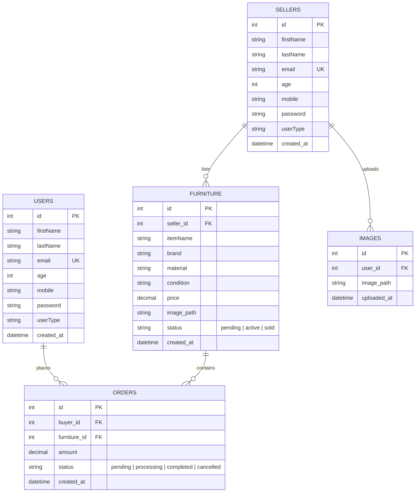

# All I Luxe — Database Schema Documentation

This document describes the relational database structure, table definitions, relationships, and sample queries used in the **All I Luxe** e-commerce platform.

---

## 📊 Entity Relationship Diagram



---

## 🗃️ Table Schema Definitions

### 1. `users` Table
Stores buyer and standard customer account profiles.

```sql
CREATE TABLE IF NOT EXISTS `users` (
  `id` INT AUTO_INCREMENT PRIMARY KEY,
  `firstName` VARCHAR(100) NOT NULL,
  `lastName` VARCHAR(100) NOT NULL,
  `email` VARCHAR(150) NOT NULL UNIQUE,
  `age` INT NOT NULL,
  `mobile` VARCHAR(20) NOT NULL,
  `password` VARCHAR(255) NOT NULL,
  `userType` VARCHAR(50) DEFAULT 'user',
  `created_at` TIMESTAMP DEFAULT CURRENT_TIMESTAMP
) ENGINE=InnoDB DEFAULT CHARSET=utf8mb4;
```

### 2. `sellers` Table
Stores verified consignment furniture sellers.

```sql
CREATE TABLE IF NOT EXISTS `sellers` (
  `id` INT AUTO_INCREMENT PRIMARY KEY,
  `firstName` VARCHAR(100) NOT NULL,
  `lastName` VARCHAR(100) NOT NULL,
  `email` VARCHAR(150) NOT NULL UNIQUE,
  `age` INT NOT NULL,
  `mobile` VARCHAR(20) NOT NULL,
  `password` VARCHAR(255) NOT NULL,
  `userType` VARCHAR(50) DEFAULT 'seller',
  `created_at` TIMESTAMP DEFAULT CURRENT_TIMESTAMP
) ENGINE=InnoDB DEFAULT CHARSET=utf8mb4;
```

### 3. `furniture` Table
Stores luxury furniture pieces submitted for appraisal and listing.

```sql
CREATE TABLE IF NOT EXISTS `furniture` (
  `id` INT AUTO_INCREMENT PRIMARY KEY,
  `seller_id` INT NOT NULL,
  `itemName` VARCHAR(200) NOT NULL,
  `brand` VARCHAR(100) NOT NULL,
  `material` VARCHAR(100) NOT NULL,
  `condition` ENUM('excellent', 'good', 'fair') NOT NULL,
  `price` DECIMAL(10,2) NOT NULL,
  `image_path` VARCHAR(255) DEFAULT NULL,
  `status` ENUM('pending', 'active', 'sold', 'rejected') DEFAULT 'pending',
  `created_at` TIMESTAMP DEFAULT CURRENT_TIMESTAMP,
  FOREIGN KEY (`seller_id`) REFERENCES `sellers`(`id`) ON DELETE CASCADE
) ENGINE=InnoDB DEFAULT CHARSET=utf8mb4;
```

### 4. `orders` Table
Tracks purchase transactions and payments.

```sql
CREATE TABLE IF NOT EXISTS `orders` (
  `id` INT AUTO_INCREMENT PRIMARY KEY,
  `buyer_id` INT NOT NULL,
  `furniture_id` INT NOT NULL,
  `amount` DECIMAL(10,2) NOT NULL,
  `status` ENUM('pending', 'completed', 'cancelled') DEFAULT 'pending',
  `created_at` TIMESTAMP DEFAULT CURRENT_TIMESTAMP,
  FOREIGN KEY (`buyer_id`) REFERENCES `users`(`id`),
  FOREIGN KEY (`furniture_id`) REFERENCES `furniture`(`id`)
) ENGINE=InnoDB DEFAULT CHARSET=utf8mb4;
```

### 5. `images` Table
Tracks uploaded image files linked to sellers.

```sql
CREATE TABLE IF NOT EXISTS `images` (
  `id` INT AUTO_INCREMENT PRIMARY KEY,
  `user_id` INT NOT NULL,
  `image_path` VARCHAR(255) NOT NULL,
  `uploaded_at` TIMESTAMP DEFAULT CURRENT_TIMESTAMP
) ENGINE=InnoDB DEFAULT CHARSET=utf8mb4;
```

---

## ⚡ Key Database Queries

### Admin Dashboard Overview Statistics
```sql
-- Count active sellers
SELECT COUNT(*) AS totalSellers FROM sellers;

-- Count active furniture listings
SELECT COUNT(*) AS activeListings FROM furniture WHERE status = 'active';

-- Count listings waiting for administrator approval
SELECT COUNT(*) AS pendingApprovals FROM furniture WHERE status = 'pending';

-- Sum total completed sales revenue
SELECT COALESCE(SUM(amount), 0) AS totalSales FROM orders WHERE status = 'completed';
```
